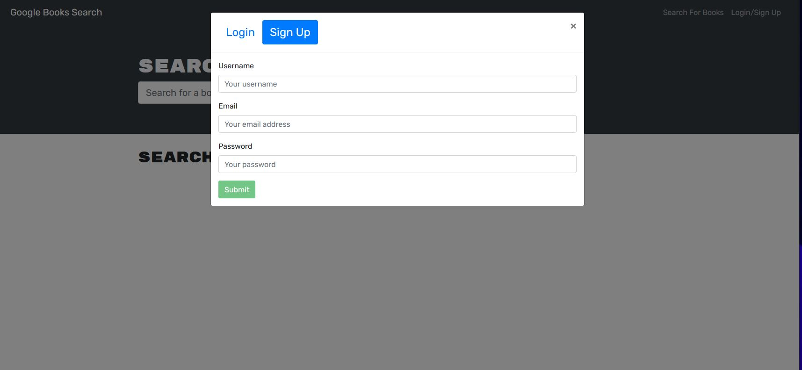
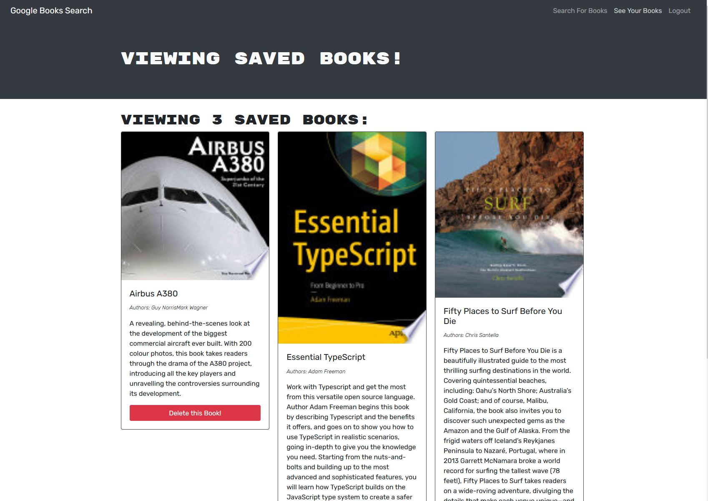

# Book Search Engine

  ## Table of Content
  * [Description](#description)
  * [App Overview](#app-overview)
  * [Deployed App](#deployed-app)
  * [Contributions](#contributions)

## Description
This Apps converts a fully functional RESTful api into a GraphQL api build with Apollo Server using the MERN stack. [starter code](https://github.com/coding-boot-camp/solid-broccoli)

## App Overview

## Deployed App
[Deployed App](https://book-search-ucf.herokuapp.com/)

## Contributions
contributions are always welcome!